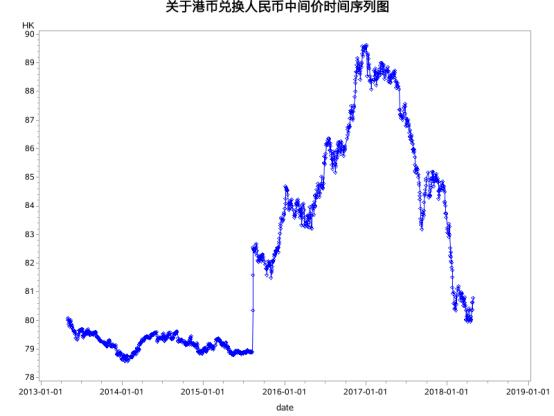
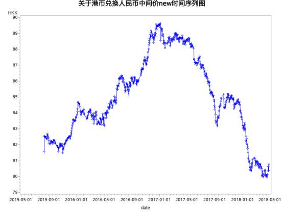
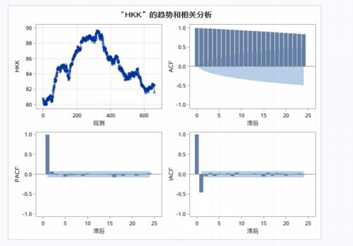
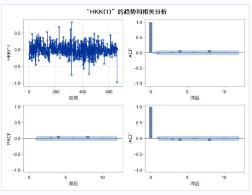
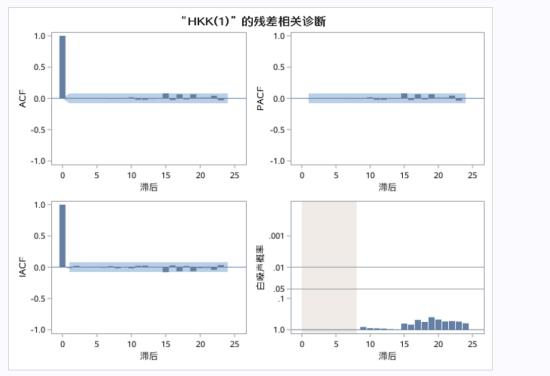
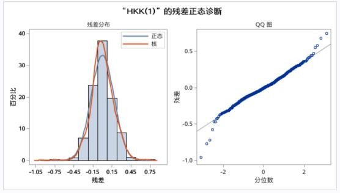
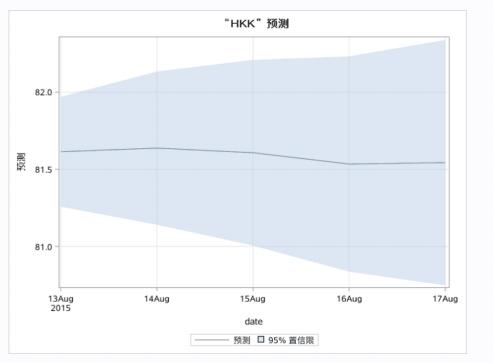

# Centralparity-rate-of-HKdollar-RMB-Time-series-analysis-SAS-2018-statistics-computing-hmwork

## BackGround
Since 2018, the exchange rate of the US dollar against the Hong Kong dollar has hit the weak side exchange guarantee of 7.85, and the Hong Kong Monetary Authority has entered the market for the first time in 13 years to buy Hong Kong dollars. Afterwards, the Hong Kong Monetary Authority conducted a total of 13 foreign exchange interventions, selling US dollars in the foreign exchange market and buying around 51 billion Hong Kong dollars to maintain the linked exchange rate. The recent weakening of the Hong Kong dollar exchange rate has repeatedly touched upon weak side guarantees and the intervention of the Hong Kong Monetary Authority in the market. This is a normal phenomenon for Hong Kong to follow the United States into the process of substantial interest rate hikes in the context of the current US dollar interest rate hike, and does not mean that the Hong Kong linked exchange rate system will change.

This article first analyzes the data of Hong Kong dollar against Chinese yuan through descriptive statistics, specifically screens the data, studies the data characteristics of this variable, and observes the skewness and kurtosis of the data; Secondly, the future trend of the Hong Kong dollar against the Chinese yuan will be analyzed through time series analysis. Two months after the completion of this article, the advantages and disadvantages of using time series analysis methods will be analyzed by comparing the real trend of the Hong Kong dollar against the Chinese yuan; Finally, obtain specific results and attempt to explore the most suitable interest rate tool for # hedging # against the Hong Kong dollar against the Chinese yuan.

## Descriptive statistics

# Table 1: HKDCNY Average  
**Analysis Variable:** HK  

| Count | Mean      | Standard Deviation | Minimum   | Maximum   |
|-------|-----------|--------------------|-----------|-----------|
| 1218  | 82.3443358 | 3.4421556          | 78.5750000 | 89.6380000 |

We can observe that among the 1218 data points, the minimum value is around 78.5, and the maximum value is around 89.63. The minimum value represents the moment when the Hong Kong Dollar (HKD) had the highest value compared to the same amount of Renminbi (CNY), while the maximum value represents the time when the Hong Kong Dollar had the lowest value.

Next, we will look at the distribution of the HKD to CNY midpoint exchange rate through Figure 1:

We found that, over five years, the HKDCNY value of 79.2 occurred the most frequently, followed by 79.8 and 78.6.

## 2. Exploratory Descriptive Statistics
Using SAS software, we obtained the exploratory descriptive statistics of the HKDCNY midpoint exchange rate over the given time period, as shown below:

### Table 2: Exploratory Data on HKD to CNY Midpoint Exchange Rate

| Metric | Value | Metric | Value |
|--------|-------|--------|-------|
| Count            | 1218        | Weighted Sum     | 1218       |
| Mean             | 82.3443358  | Total Observations | 100295.401 |
| Standard Deviation | 3.4421556 | Variance         | 11.8484352 |
| Skewness         | 0.58840951  | Kurtosis         | -1.064352  |
| Uncorrected SS   | 8273177.72  | Corrected SS     | 14419.5456 |
| Coefficient of Variation | 4.18019718 | Standard Error of Mean | 0.09862951 |

#### Basic Statistical Measures
| Position | Variability |
|----------|-------------|
| Mean     | 82.34434    |
| Standard Deviation | 3.44216 |
| Median   | 80.96250    |
| Variance | 11.84844    |
| Mode     | 79.56200    |
| Range    | 11.06300    |
| Interquartile Range | 5.65100 |

#### Position Test: Mu0 = 0
| Test    | Statistic | p-value |
|---------|-----------|---------|
| Student t | 834.8854  | Pr > t  < .0001 |
| Sign M | 609        | Pr >= M < .0001 |

#### Signed-Rank Test: Mu0 = 0
| Test    | Statistic  | p-value |
|---------|------------|---------|
| Signed-Rank S | 371185.5 | Pr >= S < .0001 |

#### Extreme Observations
| Minimum Value | Observation | Maximum Value | Observation |
|---------------|-------------|---------------|-------------|
| 78.575        | 1046        | 89.560        | 324         |
| 78.594        | 1037        | 89.577        | 332         |
| 78.601        | 1047        | 89.583        | 323         |
| 78.620        | 1036        | 89.586        | 321         |
| 78.623        | 1055        | 89.638        | 320         |

Since the analysis here focuses mainly on time series data, **skewness** and **kurtosis** are usually good measures for evaluating time series data. 

**Skewness** is a statistic that describes the degree of asymmetry in a distribution. It is used to measure symmetry in a time series. If the skewness is negative, the left side of the mean has more spread than the right side. If the skewness is positive, the left side of the mean has less spread than the right side. For a **normal distribution** (or strictly symmetrical distribution), skewness equals 0. Skewness is the **standardized 3rd central moment** of the distribution (for a normal distribution, skewness = 0). If skewness > 0, it indicates a **right-tailed distribution**, and if skewness < 0, it indicates a **left-tailed distribution**. 

When the skewness is greater than 0, the distribution is **right-skewed** with a heavier tail on the right. In stock markets, **A-shares** (stock indices) tend to be **left-skewed**, while individual stocks are more often right-skewed. In the stock market, stocks with right-skewed returns are often attractive to speculators, as there is a chance of achieving large returns, i.e., "small bets for big gains." Therefore, it is advised to avoid these stocks.

### Kurtosis
The concept of **kurtosis**: Kurtosis is a measure used to reflect the sharpness or flatness of the peak of a frequency distribution curve. Sometimes, two data sets can have the same arithmetic mean, standard deviation, and skewness but differ in the sharpness of their distribution peaks. Here, the kurtosis is less than 0. The closer the kurtosis is to 0, the more the distribution resembles a **normal distribution**. The further from 0 it is, the less the data resembles a normal distribution. If the kurtosis is negative, it indicates that the data is more concentrated, with fewer data points on either side. If it's positive, the opposite is true.

## 2. Time Series Analysis Based on SAS

### 1) Time Series Plot
Starting from May 2, 2013, we used SAS software to generate the time series plot (here, missing values are not considered), as shown below:

**Figure 2: Time Series Plot of HKD to CNY Midpoint Exchange Rate**

At this point, we found that this plot does not match the skewness and kurtosis from the previous basic data analysis. The long tail from the previous analysis should be on the right side, but here it appears to be on the left.

We noticed that in late 2015, the time series shows a significant upward jump. Therefore, we need to exclude the data before this point and reconsider the analysis.

### 2) Re-selecting Data Starting from August 12, 2015
This date marks the time around the last intervention by the Hong Kong Monetary Authority. 

Using SAS software, we obtained the following exploratory descriptive statistics for the HKD to CNY midpoint exchange rate during the given period:

**Table 3: Exploratory Data on HKD to CNY Midpoint Exchange Rate (New Data)**

| Metric            | Value         | Metric           | Value       |
|-------------------|---------------|------------------|-------------|
| Count             | 660           | Weighted Sum     | 660         |
| Mean              | 84.9861061    | Total Observations | 56090.83    |
| Standard Deviation| 2.55890042    | Variance         | 6.54797138  |
| Skewness          | 0.02556438    | Kurtosis         | -0.9271087  |
| Uncorrected SS    | 4771256.34    | Corrected SS     | 4315.11314  |
| Coefficient of Variation | 3.01096325 | Standard Error of Mean | 0.09960506 |

At this point, we observe that the skewness of this time series is still greater than 0, indicating a right-skewed tail in the time series plot.

### 3) Time Series Plot with New Data
Using SAS software, we generated the time series plot for the HKD to CNY midpoint exchange rate with the new data, as shown below:

**Figure 3: Time Series Plot of HKD to CNY Midpoint Exchange Rate (New Data)**

We found that the trend in the new data is much smoother and closer to a normal distribution.

### 4) Testing the Stationarity of the New Time Series
Using SAS software, we performed a stationarity test on the HKD to CNY midpoint exchange rate for the given period:

**Table 4: ARIMA Process**

| Statistic         | Value       | Statistic       | Value        |
|-------------------|-------------|-----------------|--------------|
| Mean              | 84.98611    | Standard Deviation | 2.556961    |
| Count             | 660         |                 |              |

**Autocorrelation Check for White Noise**

| Lag   | Chi-Square | DF   | Pr > Chi-Square | Autocorrelation |
|-------|------------|------|-----------------|-----------------|
| 6     | 3839.39    | 6    | < .0001         | 0.994           |
| 12    | 7424.00    | 12   | < .0001         | 0.960           |
| 18    | 9999.99    | 18   | < .0001         | 0.920           |
| 24    | 9999.99    | 24   | < .0001         | 0.876           |

We observed that the autocorrelation of the sample has a slow decreasing trend, so we performed first-order differencing, as shown in the table below:

**Table 5: ARIMA Process (First-order Differencing)**

| Lag   | Chi-Square | DF   | Pr > Chi-Square | Autocorrelation |
|-------|------------|------|-----------------|-----------------|
| 6     | 5.82       | 6    | 0.4436          | -0.027          |
| 12    | 10.41      | 12   | 0.5804          | -0.005          |

After the first-order differencing, we can consider this time series to be stationary.

### 5) Model Identification

Based on SAS software, we identified the best model for the time series:

**Table 5: ARIMA Process**

| Lag   | Chi-Square | DF   | Pr > Chi-Square | Autocorrelation |
|-------|------------|------|-----------------|-----------------|
| 6     | 5.82       | 6    | 0.4436          | -0.027          |
| 12    | 10.41      | 12   | 0.5804          | -0.005          |
| 18    | 17.92      | 18   | 0.4611          | -0.000          |

### Minimum Information Criterion

| Lag  | MA 0      | MA 1      | MA 2      | MA 3      | MA 4      | MA 5      | MA 6      |
|------|-----------|-----------|-----------|-----------|-----------|-----------|-----------|
| AR 0 | -3.42345  | -3.41533  | -3.40577  | -3.39727  | -3.39358  | -3.38553  | -3.37624  |
| AR 1 | -3.41523  | -3.40564  | -3.39601  | -3.38757  | -3.38386  | -3.37572  | -3.36641  |
| AR 2 | -3.40562  | -3.39595  | -3.38650  | -3.37842  | -3.37550  | -3.36744  | -3.35801  |
| AR 3 | -3.39690  | -3.38730  | -3.37816  | -3.36922  | -3.36566  | -3.35763  | -3.34817  |
| AR 4 | -3.39433  | -3.38454  | -3.37627  | -3.36650  | -3.35789  | -3.34983  | -3.34040  |
| AR 5 | -3.38628  | -3.37651  | -3.36811  | -3.35831  | -3.34981  | -3.34089  | -3.33155  |
| AR 6 | -3.37704  | -3.36726  | -3.35869  | -3.34887  | -3.34036  | -3.33151  | -3.32195  |

**Error Sequence Model:** AR(8)  
**Minimum BIC Value:** BIC(0,0) = -3.42345

The minimum information criterion and corresponding model is **AR(8)**.

### 6) Model Fitting and Diagnostics

Using SAS software, we fitted the model and obtained the following data:

**Figure 4: Residual Autocorrelation Diagnostic for First-order Differencing**

The model passed the white noise test, indicating that the fit is sufficient, and the standard error of residuals is similar to the previous estimate. Therefore, this result is what we expected.

### 7) Model Forecasting

Based on SAS software, we obtained the forecasting results, as shown below:

**Table 6: Forecast of HKD to CNY Midpoint Exchange Rate**

| Observation | Forecast  | Standard Error | 95% Confidence Interval |
|-------------|-----------|----------------|-------------------------|
| 661         | 81.6140   | 0.1816         | 81.2581 to 81.9698       |
| 662         | 81.6374   | 0.2530         | 81.1415 to 82.1333       |

We can therefore obtain the range of future trends for the HKD to CNY exchange rate. Based on the trend line, we can predict the future trajectory of the Hong Kong Dollar, and the trend at the end of May 2018 is upward.

## Conclusion
The Hong Kong Monetary Authority intervened in 2015 with its monetary policy, so data prior to that time needs to be excluded for effective analysis. The HKD to CNY midpoint exchange rate was stable between August 2015 and April 2018, with the final model being **AR(8)**. This model passed the white noise test and fit the data well.

Using only **skewness** and **kurtosis** to analyze the trend of the Hong Kong Dollar is incomplete. Time series plots must also be used, but skewness and kurtosis provide clues to the nature of the model.

